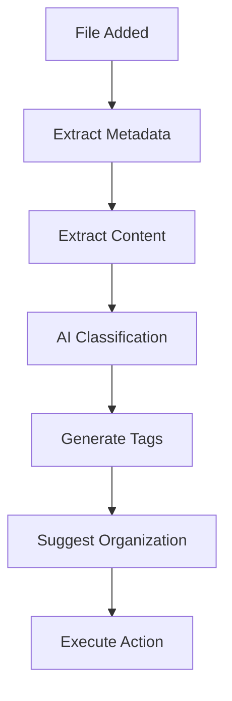

# 🔮 FlowGenius - AI-Enhanced File Manager

FlowGenius is an intelligent desktop file manager that uses AI to automatically organize, classify, and manage your files. Built with Electron, LangGraph, and N8N, it provides sophisticated automation and intelligence that traditional file managers can't match.

## ✨ Features

### 🧠 AI-Powered File Analysis
- **Smart Classification**: Automatically categorizes files into types (document, code, media, personal, work, etc.)
- **Content Understanding**: Analyzes PDF, Word, text, and code files to understand their content
- **Intelligent Tagging**: Generates relevant tags for easy searching and organization
- **Confidence Scoring**: Provides confidence levels for all AI decisions

### 🔄 Automated Workflows
- **Real-time Monitoring**: Watches directories for file changes in the background
- **Auto-organization**: Automatically moves files to appropriate folders based on AI analysis
- **LangGraph Integration**: Uses state-of-the-art AI workflow orchestration
- **N8N Compatibility**: Supports visual workflow automation

### 📁 Smart File Management
- **Intelligent Organization**: Suggests optimal folder structures based on file content
- **Duplicate Detection**: Identifies and manages duplicate files
- **Backup & Recovery**: Safely backs up file organization changes
- **Batch Operations**: Process multiple files simultaneously

### 🎨 Modern Interface
- **Intuitive Design**: Clean, modern UI built with React
- **Real-time Updates**: Live monitoring and progress indicators
- **Multi-tab Interface**: Browse files, view AI analysis, monitor activity, and configure settings
- **Responsive Layout**: Adapts to different screen sizes and preferences

## 🚀 Quick Start

### Prerequisites
- Node.js (v16 or higher)
- npm or yarn
- OpenAI API Key (for AI analysis)

### Installation

1. **Clone the repository**
   ```bash
   git clone https://github.com/yourusername/flowgenius.git
   cd flowgenius
   ```

2. **Install dependencies**
   ```bash
   npm install
   ```

3. **Configure API Keys**
   ```bash
   cp config.example.json config.json
   # Edit config.json and add your OpenAI API key
   ```

4. **Start the application**
   ```bash
   npm start
   ```

## 🔧 Configuration

### API Setup
1. Get an OpenAI API key from [OpenAI Dashboard](https://platform.openai.com/api-keys)
2. Copy `config.example.json` to `config.json`
3. Add your API key to the configuration file:

```json
{
  "api": {
    "openai": {
      "apiKey": "your_actual_api_key_here",
      "model": "gpt-4",
      "temperature": 0.1
    }
  }
}
```

### File Monitoring
Configure which directories to monitor and organization rules:

```json
{
  "fileMonitoring": {
    "watchDepth": 2,
    "rateLimitDelay": 2000,
    "ignoredExtensions": [".tmp", ".temp", ".log"],
    "ignoredDirectories": ["node_modules", ".git"]
  },
  "autoOrganization": {
    "enabled": true,
    "confidenceThreshold": 0.7,
    "createDirectories": true,
    "backupBeforeMove": true
  }
}
```

## 📖 How to Use

### 1. File Browser Tab
- **Navigate Directories**: Click on folders to browse your file system
- **Select Files**: Click on files to select them for analysis or organization
- **Analyze Files**: Click "🧠 Analyze Selected" to get AI insights about a file
- **Auto-organize**: Click "✨ Auto Organize" to automatically organize selected files

### 2. AI Analysis Tab
- **View Analysis Results**: See detailed AI analysis of files including:
  - Classification (document, code, media, etc.)
  - Confidence score (how certain the AI is)
  - Generated tags for organization
  - Suggested organization location
- **Organization Suggestions**: Review recent AI suggestions for file organization

### 3. Monitoring Tab
- **Real-time Status**: Monitor file processing queue and activity
- **Activity Feed**: See recent file analysis and organization actions
- **Performance Metrics**: Track processed files and system performance

### 4. Settings Tab
- **AI Configuration**: Adjust confidence thresholds and enable/disable auto-organization
- **API Settings**: Configure OpenAI API key and model settings
- **UI Preferences**: Customize appearance and behavior

## 🤖 AI Workflow Architecture

### LangGraph Integration
FlowGenius uses LangGraph to create sophisticated AI workflows:



### Workflow Steps
1. **Metadata Extraction**: File size, type, creation date, etc.
2. **Content Analysis**: Extract text from PDFs, Word docs, code files
3. **AI Classification**: Use GPT-4 to categorize and understand content
4. **Tag Generation**: Create relevant tags for search and organization
5. **Organization Suggestion**: Recommend optimal folder structure
6. **Action Execution**: Automatically organize or present suggestions

## 🔗 N8N Integration

FlowGenius supports N8N for advanced workflow automation:

- **Webhook Triggers**: Automatically trigger workflows when files are added
- **Custom Actions**: Create custom file processing workflows
- **External Integrations**: Connect to cloud storage, databases, APIs
- **Visual Workflow Editor**: Design complex automation visually

## 🛠️ Development

### Project Structure
```
flowgenius/
├── src/
│   ├── main.js                 # Electron main process
│   │   └── classificationService.js  # LangGraph AI workflows
│   ├── services/
│   │   └── fileMonitor.js      # File system monitoring
│   ├── workflows/
│   │   └── orchestrator.js     # N8N workflow integration
│   └── renderer/
│       ├── index.html          # UI entry point
│       └── app.js              # React application
├── package.json                # Dependencies and scripts
├── webpack.config.js           # Build configuration
└── config.example.json         # Configuration template
```

### Build Commands
```bash
# Development mode
npm start

# Build for production
npm run build

# Create distributable
npm run build-electron
```

### File Classification Categories
- **document**: PDFs, Word docs, important text files
- **code**: Source code, scripts, configuration files
- **media**: Images, videos, audio files
- **archive**: Zip files, compressed archives
- **temporary**: Cache files, logs, temporary files
- **personal**: Personal documents, photos, letters
- **work**: Work-related documents, presentations
- **financial**: Invoices, receipts, financial documents
- **educational**: Study materials, research papers
- **misc**: Everything else

## 🔒 Privacy & Security

- **Local Processing**: All AI analysis runs locally through API calls
- **No Data Storage**: FlowGenius doesn't store your file contents
- **Secure API Usage**: API keys are stored locally and never transmitted
- **File Backup**: Original file locations are backed up before any moves
- **Reversible Actions**: All organization actions can be undone

## 🤝 Contributing

1. Fork the repository
2. Create a feature branch (`git checkout -b feature/amazing-feature`)
3. Commit your changes (`git commit -m 'Add amazing feature'`)
4. Push to the branch (`git push origin feature/amazing-feature`)
5. Open a Pull Request

## 📝 License

This project is licensed under the MIT License - see the [LICENSE](LICENSE) file for details.

## 🆘 Support

- **Issues**: [GitHub Issues](https://github.com/yourusername/flowgenius/issues)
- **Discussions**: [GitHub Discussions](https://github.com/yourusername/flowgenius/discussions)
- **Email**: support@flowgenius.ai

## 🎯 Roadmap

- [ ] **Enhanced AI Models**: Support for local AI models (Ollama, etc.)
- [ ] **Cloud Integration**: Sync with Google Drive, Dropbox, OneDrive
- [ ] **Advanced Rules**: Custom organization rules and filters
- [ ] **Mobile Companion**: Mobile app for remote file management
- [ ] **Team Features**: Shared organization rules and collaborative workflows
- [ ] **Plugin System**: Extensible architecture for third-party plugins

## 🙏 Acknowledgments

- [LangGraph](https://github.com/langchain-ai/langgraph) - AI workflow orchestration
- [N8N](https://n8n.io/) - Workflow automation platform
- [Electron](https://www.electronjs.org/) - Desktop app framework
- [OpenAI](https://openai.com/) - AI language models

---

**Built with ❤️ for productivity enthusiasts who believe files should organize themselves.** 